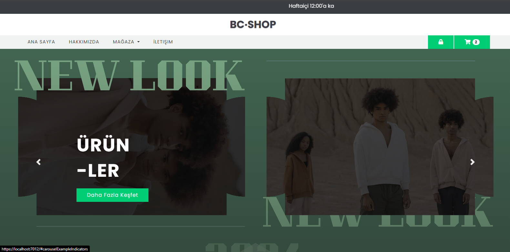
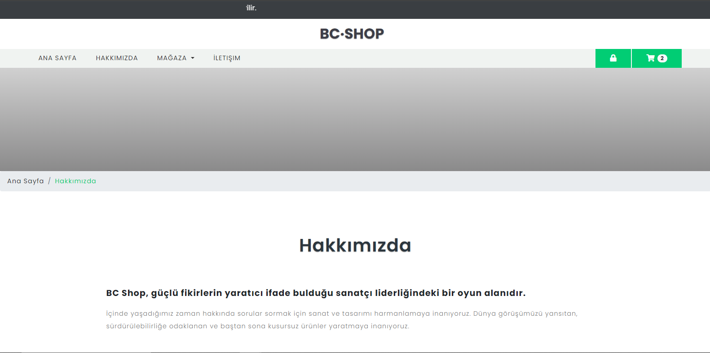
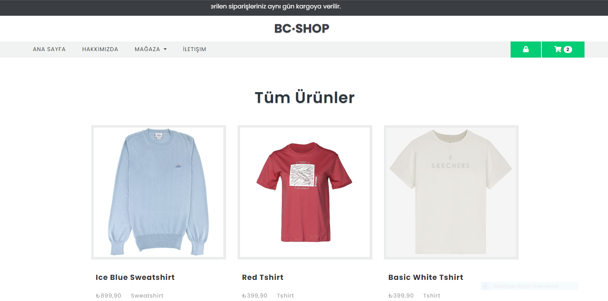
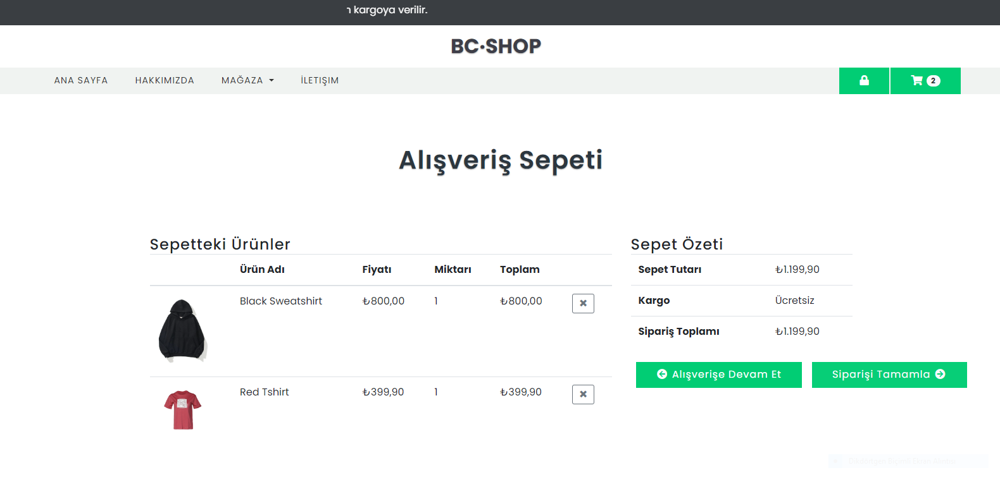
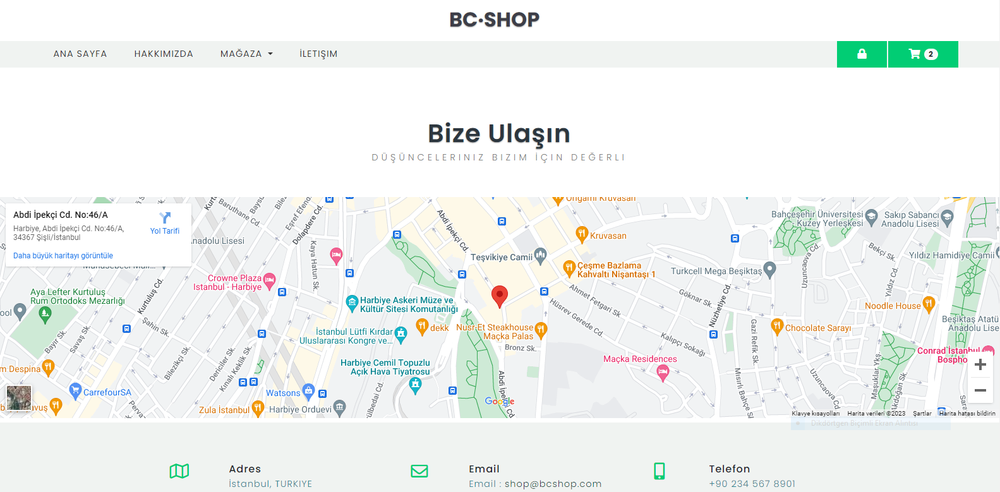
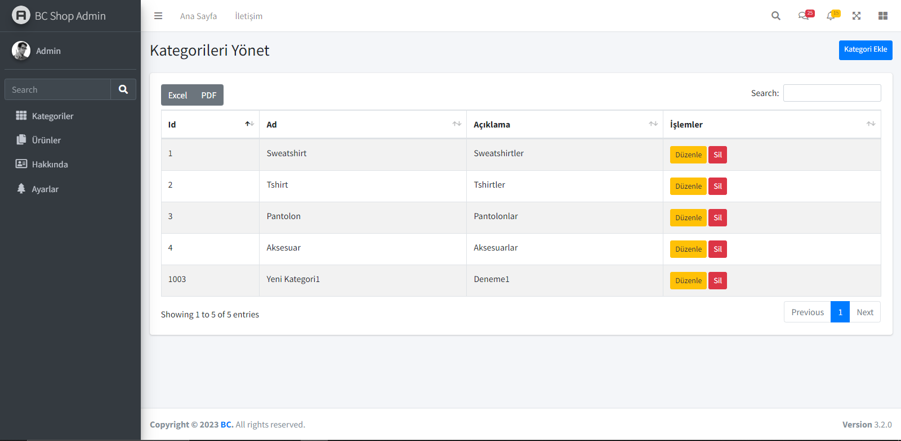

# Asp.Net Core MVC ile E-Ticaret Butik Sitesi Projesi

## Proje Hakkında
Bu AspNet Core 6.0 tabanlı proje, bir butik mağazasının ürünlerini ve bilgilerini yönetmesini sağlar. Kullanıcıların ürünleri görüntüleyip, yorum yapabildiği ve ürünlerini sepete eklediği etkileşimler bulunmaktadır. Hem admin hem de vitrin paneli bulunmaktadır.  

Çalıştırmak için BCShop. Data klasöründe Context sınıfından yerel SQL bağlantınızı yazarak ve database'i update ederek sorunsuz bir şekilde çalıştırabilirsiniz.

-Admin paneline giriş yapabilmek için kullanıcı maili : admin@admin.com parola: admin

## Özellikler

Proje, aşağıdaki ana başlıkları içermektedir:

- N Tier Architecture
- Data Access Layer
- Business Layer
- HTML, CSS, JavaScript, JQuery
- Entity Franework Core
- Repository Design Pattern

## Önizleme
`Anasayfa`

`Hakkında`

`Ürünler`

`Sepet`

`İletişim`

`Admin`

